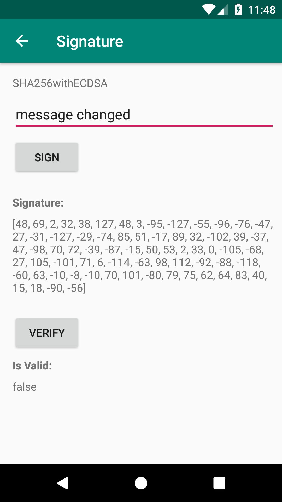

# Android cryptography playground

Basic examples of cryptographic operations in Android using the [recommended algorithms](https://developer.android.com/guide/topics/security/cryptography#choose-algorithm)

---

## Basic operations

### Cipher [`[CipherActivity.kt]`](app/src/main/java/com/spundev/cryptographyplayground/CipherActivity.kt)

Encrypts and decrypts a message using `AES/GCM/NoPadding`.

### MessageDigest [`[DigestMessageActivity.kt]`](app/src/main/java/com/spundev/cryptographyplayground/DigestMessageActivity.kt)

`SHA-256` of the given message.

### Mac [`[MacActivity.kt]`](app/src/main/java/com/spundev/cryptographyplayground/MacActivity.kt)

`HMACSHA256` of the message.

### Signature [`[SignatureActivity.kt]`](app/src/main/java/com/spundev/cryptographyplayground/SignatureActivity.kt)

Obtains the signature  of the given message using `SHA256withECDSA` and verifies the content.

---

## Android Keystore

### Basic [`[KeystoreBasicActivity.kt]`](app/src/main/java/com/spundev/cryptographyplayground/KeystoreBasicActivity.kt)

Obtains the signature of the message using a key entry from the keystore.

### With authentication [`[KeystoreFingerprintActivity.kt]`](app/src/main/java/com/spundev/cryptographyplayground/KeystoreFingerprintActivity.kt)

Obtains the signature of the message using a key entry from the keystore. However, unlike the basic example, in this case the key can only be used if the user has been authenticated. This authentication is done using the fingerprint scanner and the [biometrics library from androidx](https://developer.android.com/reference/androidx/biometrics/package-summary).

